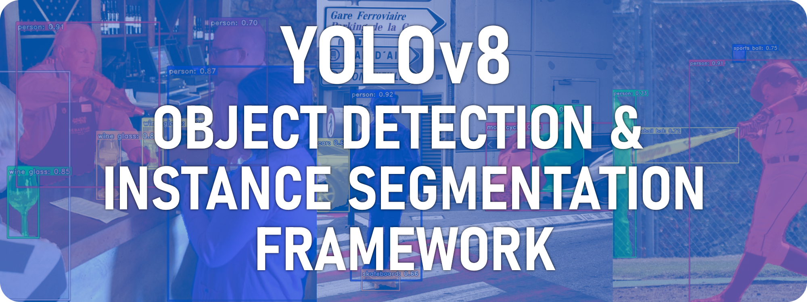
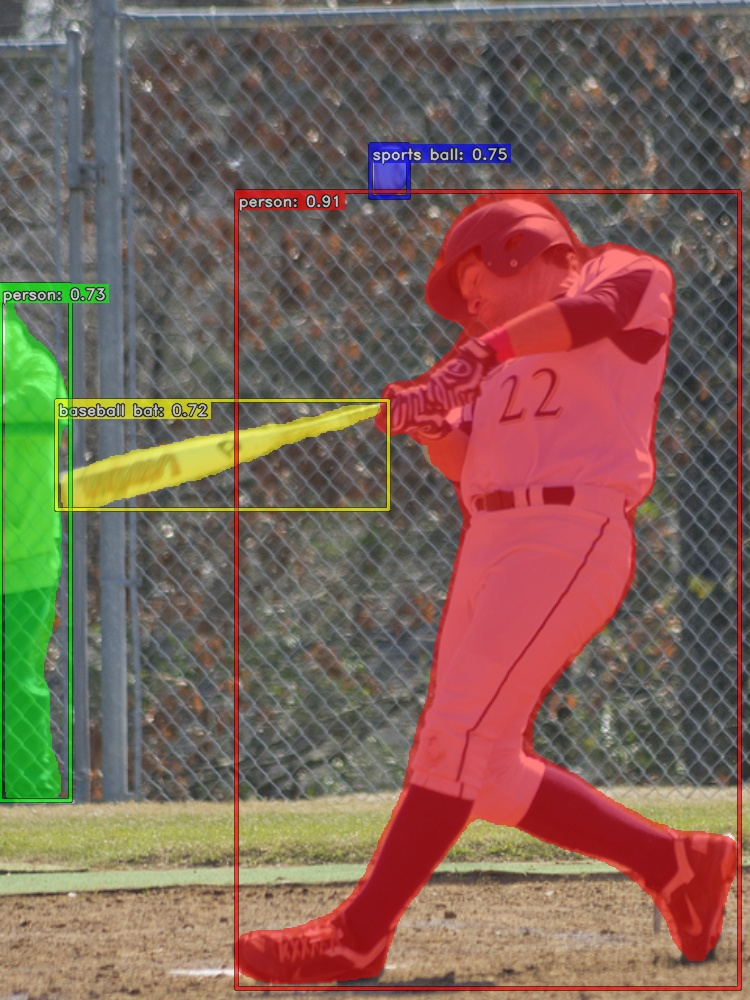
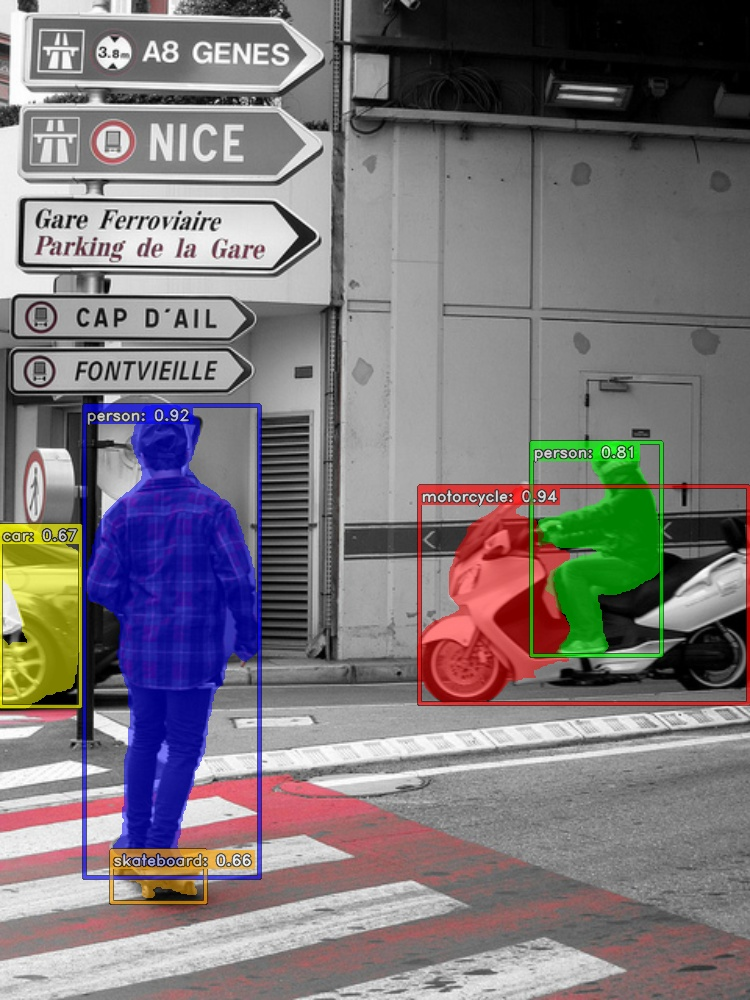
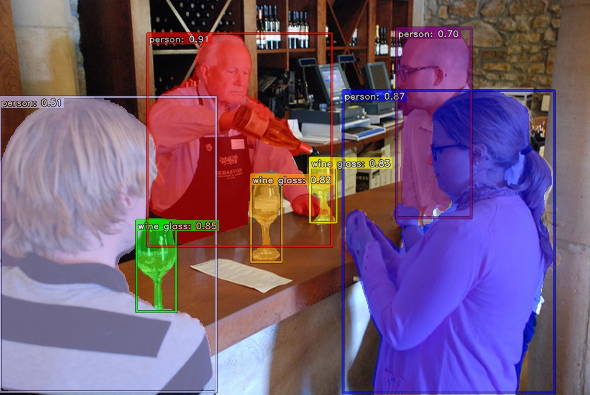

<p align="center"></p>

# YOLOv8 framework

Framework for object detection and instance segmentation models from the [YOLOv8](https://github.com/ultralytics/ultralytics) family

- [Requirements](#requirements)
- [Repository structure](#repository-structure)
- [Model weights and configuration](#model-weights-and-configuration)
- [Usage](#usage)
    - [Prepare dataset](#prepare-dataset)
    - [Train model](#train-model)
    - [Validate model](#validate-model)
    - [Preview inference](#preview-inference)


## Requirements

Environment with Python 3.8 or greater (3.11 suggested) and [PyTorch (>=1.8)](https://pytorch.org/get-started/locally/).
On devices with CUDA-enabled graphics cards, [Nvidia CUDA toolkit version 10.0 or higher](https://developer.nvidia.com/cuda-toolkit) and the corresponding version of PyTorch must be installed.

Other packages required:
- TorchVision (>=0.9.0)
- MatPlotLib (>=3.2.2)
- NumPy (>=1.22.2)
- OpenCV (>=4.6.0)
- Pillow (>=7.1.2)
- PyYaml (>=5.3.1)
- Requests (>=2.23.0)
- SciPy (>=1.4.1)
- tqdm (>=4.64.0)
- Pandas (>=1.1.4)
- Seaborn (>=0.11.0)
- psUtil
- Py-CPUinfo

as specified in [requirements.txt](requirements.txt). They can be installed using the following command:

``` pip install -r requirements.txt ```

## Repository structure

```
YOLO-FRAMEWORK
|_ configuration
    |_ training.yaml # training parameters
|_ models
    |_ data.yaml # data configuration file
    |_ model.pt # model weights file
|_ datasets
|_ inference_output
|_ training_output
|_ validation_results
|_ Code
    |_ PrepareDataset.py
    |_ Train.pydata.yaml.pt
    |_ Validate.py
    |_ Preview.py
    ...
```

## Model weights and configuration

Yolo weight file ```model.pt``` together with dataset configuration ```data.yaml``` should be placed in [models directory](models).

Default COCO dataset configuration (*coco.yaml*) can be downloaded from [here](https://github.com/ultralytics/ultralytics/blob/main/ultralytics/cfg/datasets/coco.yaml).

YOLOv8 weight files (*yolov8_.pt* / *yolov8_-seg.pt*) can be downloaded from [here](https://github.com/ultralytics/assets/releases/latest).

## Usage

### Prepare dataset

Input data structure:
```
input_data_folder
|_ class_names.txt # list of class names in plain, each class in a new line
|_ data
    |_ file1.txt # label file should have the '.txt' extension
    |_ file1.jpg # image file should have '.jpg', '.jpeg' or '.png' extension
    ...
```

1. Run [PrepareDataset.py](Code/PrepareDataset.py)
2. Select input folder with images and labels
3. Select output dataset folder in desired directory - f.e. 'datasets/datastet-example'
4. System will create a new dataset with the yaml configuration file and train, test, val subsets.

Output data structure:
```
output_data_folder
|_ data.yaml # dataset configuration file
|_ train
    |_ file1.txt
    |_ file1.jpg
    ...
|_ val
    ...
|_ test
    ...
```

### Train model

1. Run [Train.py](Code/Train.py)
2. Select [model size](https://docs.ultralytics.com/models/yolov8/#supported-modes)
3. Select output dataset folder in desired directory - f.e. 'datasets/datastet-example'
4. Training output is saved to the [training_output](training_output)

Parameters in Train.py:
- ```i_Epochs``` - number of training epochs
- ```i_BatchSize``` - training batch size
- ```f_ConfThreshTest``` - confidence threshold during training

Advanced parameters are stored in [configuration/training.yaml](configuration/training.yaml).

```
training_output
|_ 20230101_000000 # Folder with training date
    |_ plots # metrics 
        ...
    |_ test_inference # inference on test subset
        ...
    |_ weights
        |_ best.pt # best weights
        |_ last.pt # last epoch weights
        |_ data.yaml # dataset configuration file
    ...
...
```

### Validate model

1. Run [Validate.py](Code/Validate.py)
2. Select dataset folder
3. Valdiation output is saved to the [validation_results](validation_results)

```
validation_results
|_ 20230101_000000 # Folder with validation date
    |_ results.json # Validation numeric results 
    ...
...
```

Output file structure:
```
{
    "mean_ap": mAP50:95,
    "mean_ap50": mAP50,
    "ap50": {
        "class_name": AP50,
        ...
    },
    "ap": {
        "class_name": AP50:95,
        ...
    },
    "mean_precission": MEAN_PRECISSION,
    "mean_recall": MEAN_RECALL,
    "precission": {
        "class_name": PRECISSION,
        ...
    },
    "recall": {
        "class_name": RECALL,
        ...
    },
    "mean_f1": F1,
    "f1": {
        "class_name": F1,
        ...
    },
    "speed": TOTAL_INFERENCE_TIME_PER_IMAGE
}
```

### Preview inference

1. Run [Preview.py](Code/Preview.py)
2. Select folder with input images
3. Preview will be displayed in OpenCV GUI
4. Preview output is saved to the [inference_output](inference_output) as *.txt YOLO and *.json COCO results file
5. Pressing 's' during preview will save the image file to disk, 'ESC' will close the script

Weights file: ```models/model.pt```

Data configuration file: ```models/data.yaml```

Parameters in Preview.py:
- ```f_Thresh``` - confidence threshold value

<p align="center"></p>
<p align="center"></p>
<p align="center"></p>